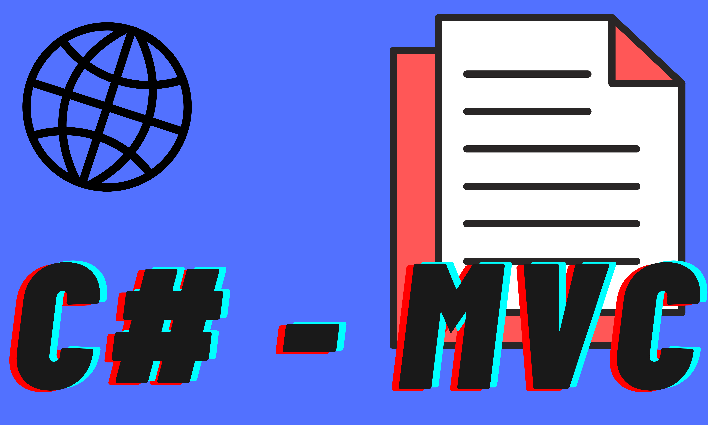

<h1 align="center">
  
</h1>
<h1 align="center"> 👨‍💻 WEB Project C# - MVC</h1>
<p align="center">Uma WEB aplication MVC, construido com c#</p>

<p align="center">
 <a href="#Features">Features</a> •
 <a href="#Tecnologias">Tecnologias</a> • 
 <a href="#Autor">Autor</a>
</p>

<h4 align="center"> 
	Web Project MVC - CRUD 🚀 Completo...
</h4>

### Features

- [x] Cadastro e visualização de vendedores
- [x] Criação e visualização de departamentos
- [x] Ediçao, detalhes e deletação dos vendedores
- [x] Ediçao dos Departamentos

### Pré-requisitos

Antes de começar, você vai precisar ter instalado em sua máquina as seguintes ferramentas:
[Git](https://git-scm.com), [dotnet](https://dotnet.microsoft.com/), [mySQL](https://www.mysql.com/downloads/). 
Além disto é bom ter um editor para trabalhar com o código como [VSCode](https://code.visualstudio.com/) ou [Visual Studio](https://visualstudio.microsoft.com/pt-br/vs/).

### 🎲 Rodando o Projeto

Configure onde está o seu MySql, abra o arquivo appsettings.json, e altere seu user e sua senha em "SalesWebMvcContext".

```bash
# Clone este repositório
$ git clone <https://github.com/Bernardo01001/WebProjectMVC.git>

# Acesse a pasta do projeto no terminal/cmd
$ cd WebProjectMVC/

# Vá para a pasta SalesWebMvc
$ cd SalesWebMvc/

# Rode as migrations para seu banco de dados ficar populado
$ dotnet ef database update

# Com tudo pronto abra seu terminal na pasta SalesWebMvc e rode o projeto, ou no Visual Studio abra o IIServer
$ dotnet run

# O servidor inciará na porta:5001 - acesse <https://localhost:5001>
```

### 🛠 Tecnologias

As seguintes ferramentas foram usadas na construção do projeto:

- [dotnet](https://dotnet.microsoft.com/)
- [EntityFramework](https://docs.microsoft.com/en-us/aspnet/entity-framework)
- [MySql](https://www.mysql.com/)

### 👱 Autor
Olá caso queira fazer networking, conversar, me passar dicas você pode me encotrar no [discord](belnaldo#9602), [github](https://github.com/Bernardo01001) e no meu [instagram](https://www.instagram.com/bernardo0_00_0/). Quero muito fazer novos amigos Devs, bora evoluir juntos 🚀.
